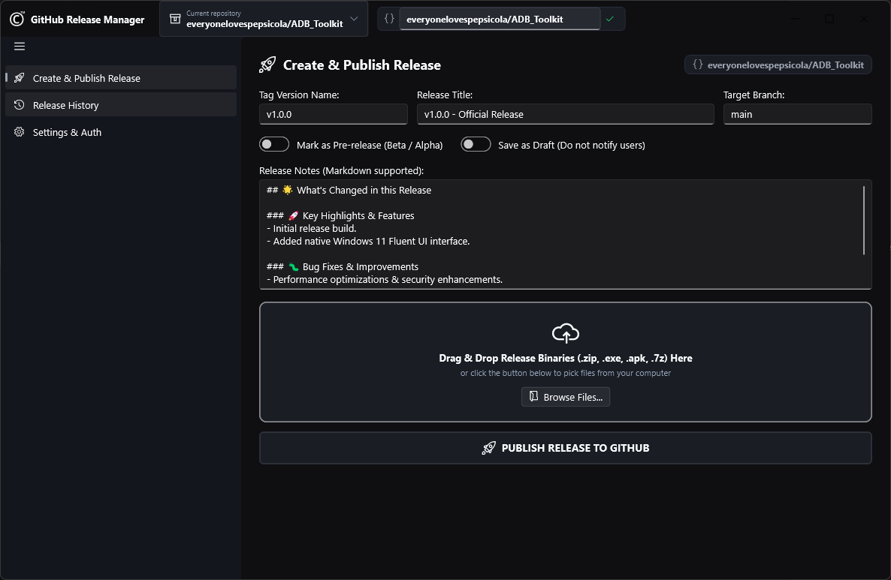
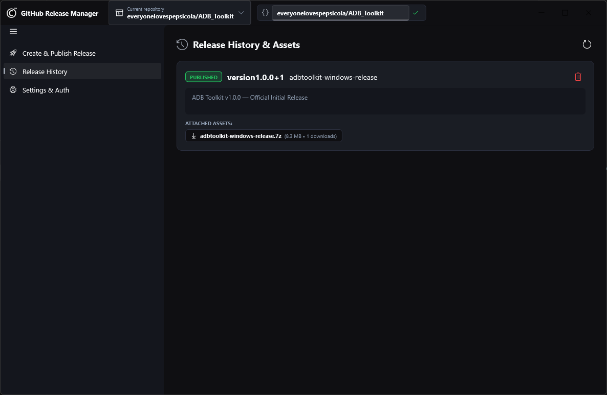

# GitHub Release Manager

<p align="center">
  
  
</p>

## Overview

**GitHub Release Manager** is a sleek, modern Fluent UI desktop application built with Flutter to streamline and automate creating, managing, and publishing GitHub releases for your repositories.

## Key Features

- 🚀 **Create Releases**: Fast and intuitive interface to draft, attach assets, add release notes, and publish releases.
- 📜 **Release History**: View and track existing releases across configured repositories.
- 📂 **Repository Management**: Easily manage multiple target repositories with integrated flyout pickers.
- 🎨 **Modern Fluent UI**: Custom-styled dark theme optimized for desktop workflows using Microsoft Fluent Design principles.
- ⚙️ **Configurable Settings**: Token management, custom defaults, and persistent user preferences.

## Prerequisites

- **Flutter SDK**: `^3.13.1` or higher
- **Target OS**: Windows Desktop (also cross-platform ready via Flutter)

## Getting Started

1. **Clone the repository:**
   ```bash
   git clone https://github.com/everyonelovespepsicola/github_releases.git
   cd github_releases
   ```

2. **Install dependencies:**
   ```bash
   flutter pub get
   ```

3. **Run the application:**
   ```bash
   flutter run -d windows
   ```

## Built With

- [Flutter](https://flutter.dev/) - Cross-platform UI framework
- [fluent_ui](https://pub.dev/packages/fluent_ui) - Windows Fluent UI widgets for Flutter
- [window_manager](https://pub.dev/packages/window_manager) - Window management for desktop Flutter apps
